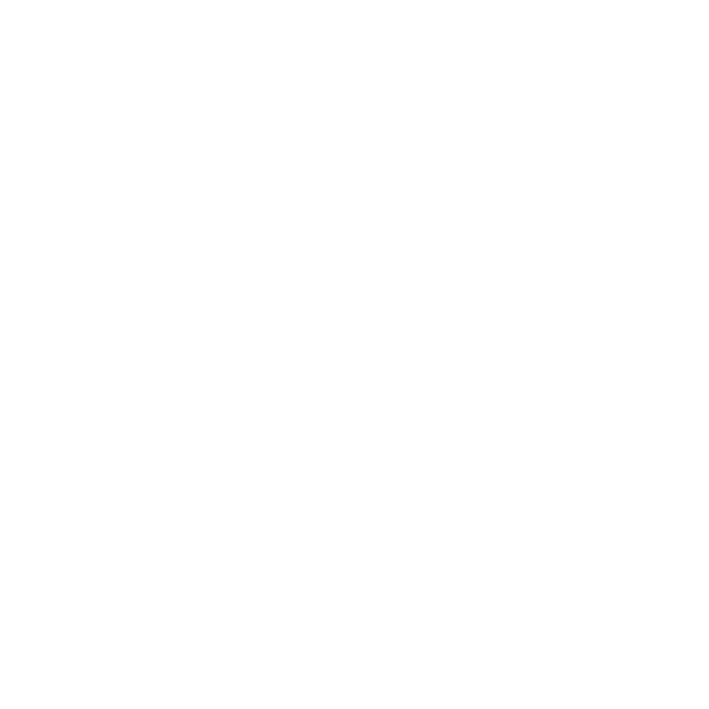

# 🧙‍♂️ Jackson Neurauter

**`Software + Security Engineer`**

<!--
**jneurauter/jneurauter** is a ✨ _special_ ✨ repository because its `README.md` (this file) appears on your GitHub profile.

Here are some ideas to get you started:

- 🔭 I’m currently working on ...
- 🌱 I’m currently learning ...
- 👯 I’m looking to collaborate on ...
- 🤔 I’m looking for help with ...
- 💬 Ask me about ...
- 📫 How to reach me: ...
- 😄 Pronouns: ...
- ⚡ Fun fact: ...
-->

I'm an undergraduate student pursuing a Computer Science degree with a focus in Cybersecurity and Artifical Intelligence. I have experience in both front end and back end development using an assortment of languages. Specifically, I have significant experience with java, python, C++, and HTML. With regard to Cybersecurity, I have 7 certifications in the realm of the management and security of network and computer systems. Current work consists of development of vehicle testing simulation software. I am interested in Machine Learning, Network Security, and Automotive projects and research.

<!-- <ul>
    <li>internship experience with C++ and microcontrollers</li>
    <li>internship experience with python, html, css, js</li>
    <li>cybersecurity/networking certifications</li>
    <li></li>
    <li></li>
    <li></li>
</ul> -->

---
### 🧰 Languages and Tools

<!--  -->
